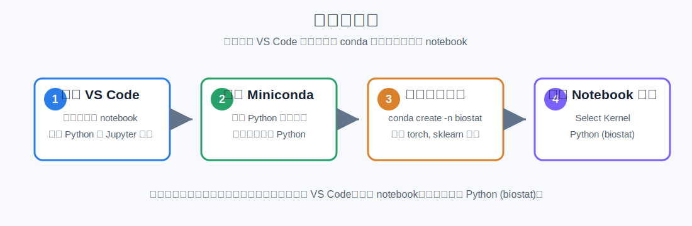
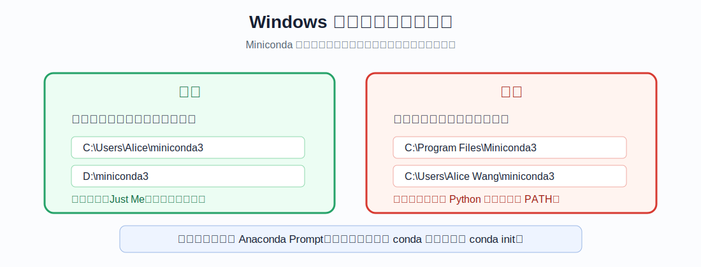
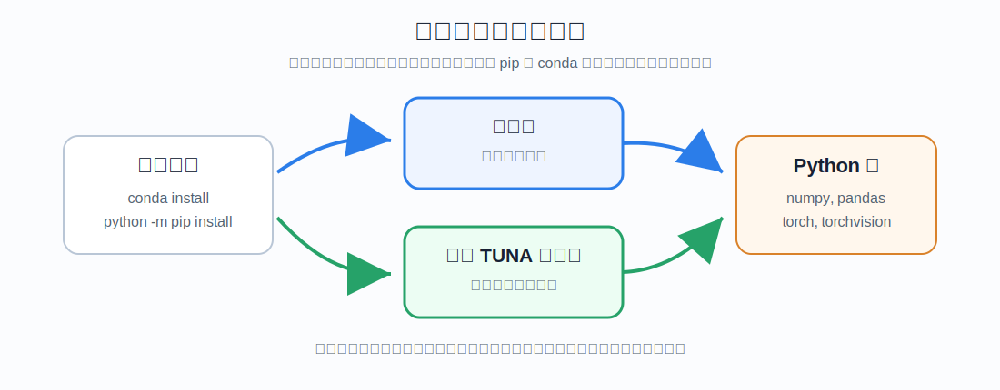
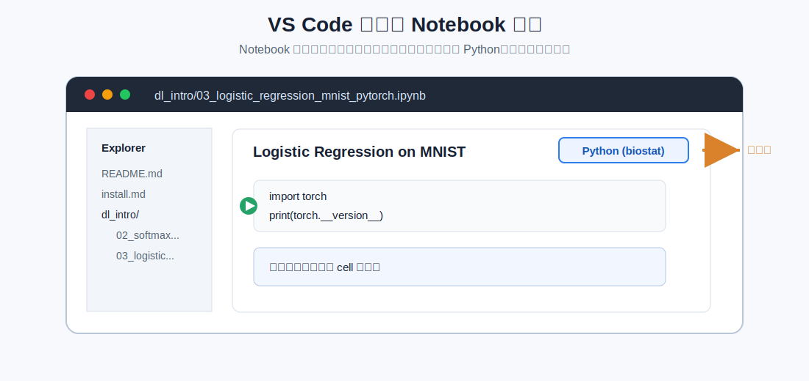
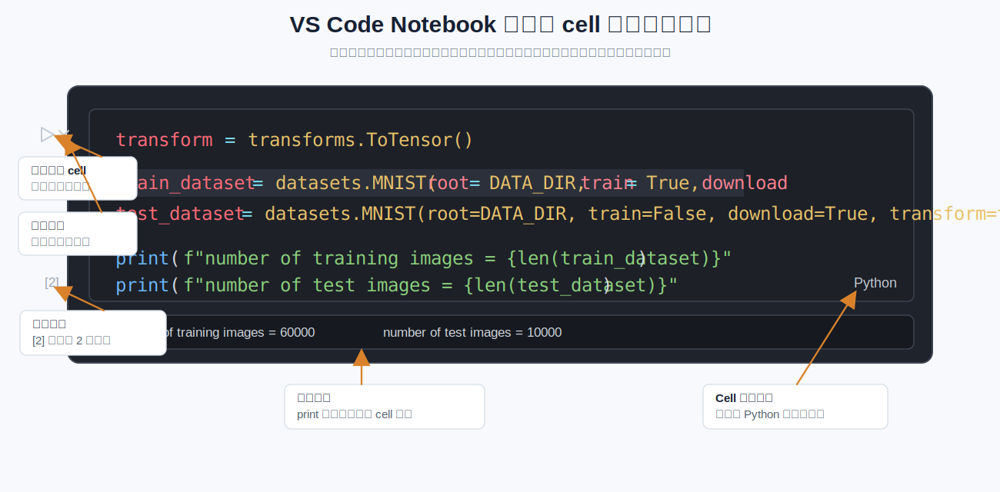
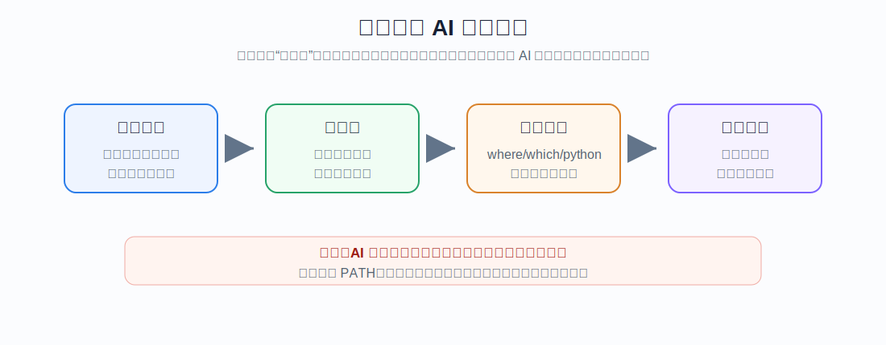

# Miniconda + VS Code 安装与 Notebook 使用教程

本文面向第一次配置 Python 学习环境的同学，覆盖 Windows 和 macOS。目标是：用 **Miniconda** 创建一个独立的课程环境，再用 **VS Code** 打开并运行 `.ipynb` notebook。

我们知道教程并不完美，不可能让每一位同学都完全理解。建议大家学习过程中多多使用AI询问，直到理解整个过程。虽然环境配置甚至可以交给一些Agent（如Claude Code，Codex）完全自主完成，但我们仍然建议大家自己过一遍流程，对日后的学习科研会非常有帮助～

大家可以探索一些高效使用AI的方法，比较详细告知任务（今天是安装软件和配置环境）、足够的上下文（比如电脑的系统、当前你对代码和命令行的了解程度）等等～

本教程的目标是可以打开`/dl_intro`中notebook，并且可以正常运行。若你已经可以运行，则就不用看啦！




## 0. 先理解我们要装什么

安装前先把几个名字分清楚。初学者最容易混淆的是：VS Code 不是 Python，Miniconda 也不是写代码的软件。

**VS Code 是代码编辑器。** 它负责打开课程文件夹、显示 `.py` 文件和 `.ipynb` notebook、提供代码补全、运行按钮、调试界面。它本身不负责安装 Python 包。

**Miniconda 是 Python 环境管理工具。** 它会安装一个基础 Python，并提供 `conda` 命令。我们用 `conda` 创建独立环境，例如 `biostat`，再在这个环境里安装 `numpy`、`pandas`、`torch` 等课程需要的包。

**conda 环境是一套独立 Python。** 一个电脑上可以有多个环境。比如 `base` 是 Miniconda 自带的基础环境，`biostat` 是本课程环境。不同环境里的 Python 版本和包可以不同，互不干扰。

**pip 是 Python 包安装工具。** `pip install 包名` 会从 PyPI 下载 Python 包。为了避免装错环境，本文统一推荐写成 `python -m pip install 包名`，这样 pip 会跟着当前激活的 Python 走。

**Jupyter kernel 是 notebook 的运行内核。** VS Code 打开 notebook 后，真正执行代码的是某个 Python kernel。我们会把 `biostat` 注册成 `Python (biostat)`，然后在 notebook 右上角选择它。

可以把这些工具的关系理解为：

| 工具 | 作用 | 类比 |
| --- | --- | --- |
| VS Code | 写代码、打开 notebook、运行 cell | 教室和黑板 |
| Miniconda | 管理 Python 版本和第三方包 | 工具箱管理员 |
| conda | 创建环境、切换环境、安装一部分软件包 | 管理工具箱的命令 |
| pip | 安装 Python 包，尤其是 PyPI 上的包 | 给当前抽屉添工具 |
| conda 环境 | 为本课程单独准备的一套 Python 和包 | 本课程专用抽屉 |
| Jupyter kernel | notebook 真正运行代码的 Python 进程 | 负责计算的发动机 |

不要把所有包都装到系统自带 Python 里。我们会创建一个课程环境，例如 `biostat`，然后在 VS Code notebook 右上角选择 `Python (biostat)`。

## 1. 下载并安装 VS Code

官方入口：

- VS Code 下载页：<https://code.visualstudio.com/Download>
- Windows 安装说明：<https://code.visualstudio.com/docs/setup/windows>
- macOS 安装说明：<https://code.visualstudio.com/docs/setup/mac>

### 1.1 Windows 安装 VS Code

1. 打开 <https://code.visualstudio.com/Download>。
2. 下载 **Windows User Installer**。官方说明中，User setup 不需要管理员权限，通常是 Windows 上推荐的安装方式。
3. 双击 `VSCodeUserSetup-版本号.exe`。
4. 一路按提示安装。**注意：不要安装在系统默认目录`Program Files`. 该目录含有空格，之后运行可能存在问题。请保证安装路径中不含中文和空格。**安装器一般会把 `code` 命令加入用户 `%PATH%`，这让我们可以在命令行中输入 `code .` 打开当前文件夹。
5. 安装完成后，关闭所有已经打开的命令行窗口，再重新打开。PATH 的变化通常要重开终端才生效。

推荐勾选的 VS Code 安装选项：

- `Add to PATH`，如果安装器显示这个选项，建议勾选。
- `Open with Code`，可选。勾选后可以在文件夹右键菜单中用 VS Code 打开。

验证 VS Code 命令行是否可用：

```bat
code --version
```

如果提示 `'code' is not recognized`，先不要重装。关闭命令行窗口后重新打开，再试一次。仍然失败也没关系，可以通过 VS Code 菜单 **File > Open Folder** 打开项目。

### 1.2 macOS 安装 VS Code

1. 打开 <https://code.visualstudio.com/Download>。
2. 下载 macOS 版本。多数同学下载官网默认的 macOS 版本即可；VS Code 官方说明提到 VS Code 支持 Apple silicon。
3. 打开下载的 `.dmg` 文件。
4. 把 `Visual Studio Code.app` 拖到 `Applications` 文件夹。
5. 从 `Applications` 打开 VS Code。


## 2. 下载并安装 Miniconda

官方入口：

- Miniconda 安装总页：<https://www.anaconda.com/docs/getting-started/miniconda/install>
- Windows 图形安装说明：<https://www.anaconda.com/docs/getting-started/miniconda/install/windows-gui-install>
- macOS 图形安装说明：<https://www.anaconda.com/docs/getting-started/miniconda/install/mac-gui-install>
- 官方安装包列表：<https://repo.anaconda.com/miniconda/>

Miniconda 比 Anaconda 更轻量。Anaconda 会预装很多包，体积更大；Miniconda 只提供 Python、conda 和基础工具，我们再按课程需要安装包。

⚠️本节开始会有一些命令行使用场景，如果对命令行不熟悉请咨询AI。另外，请务必借助AI了解环境变量的概念。

### 2.1 选择正确的 Miniconda 安装包

| 系统 | 推荐安装包 | 说明 |
| --- | --- | --- |
| Windows 10/11 64-bit | `Miniconda3-latest-Windows-x86_64.exe` | 绝大多数 Windows 同学选择这个 |
| macOS Apple Silicon | `Miniconda3-latest-MacOSX-arm64.pkg` | M1/M2/M3/M4/M5 等芯片 |
| macOS Intel | `Miniconda3-latest-MacOSX-x86_64.pkg` | 较老的 Intel Mac；Anaconda 已停止为 Intel Mac 构建新的 osx-64 包，但旧安装器仍在官方仓库 |

如何判断 Mac 是 Apple Silicon 还是 Intel：

1. 点击屏幕左上角苹果图标。
2. 选择 **About This Mac**。
3. 如果看到 `Chip: Apple M...`，选 Apple Silicon / arm64。
4. 如果看到 `Processor: Intel...`，选 Intel / x86_64。

### 2.2 Windows 安装 Miniconda



1. 打开官方下载页或官方安装包列表：
   - 官网下载页：<https://www.anaconda.com/download>
   - 直接安装包列表：<https://repo.anaconda.com/miniconda/>
2. 下载 `Miniconda3-latest-Windows-x86_64.exe`。
3. 双击安装包。
4. 选择 **I Agree**。
5. 安装类型选择 **Just Me**。这通常不需要管理员权限，也更适合个人电脑。
6. 选择安装目录。

⚠️ Windows 安装目录非常重要，请勿包含空格、中文。建议：

```text
C:\Users\你的英文用户名\miniconda3
```

或者：

```text
D:\miniconda3
```

避免：

```text
C:\Program Files\Miniconda3
C:\Users\Alice Wang\miniconda3
C:\Users\张三\miniconda3
桌面\miniconda3
OneDrive\miniconda3
```

原因：Anaconda 官方建议安装到没有空格和特殊字符的目录，以避免一些开源工具的兼容性问题。初学阶段最常见的问题就是路径里有空格、中文用户名、权限限制、OneDrive 同步路径。

安装选项建议：

- 如果看到 **Add Miniconda3 to my PATH environment variable**，初学者建议不要勾选。优先使用 **Anaconda Prompt**，避免多个 Python 混在系统 PATH 里。
- 如果看到 **Register Miniconda3 as my default Python**，不确定时保持默认即可。本课程会显式创建和选择 `biostat` 环境，不依赖系统默认 Python。
- 不要以 Administrator 身份安装，除非电脑管理员明确要求。

安装完成后，打开：

```text
Start Menu（键盘上的win键） > Anaconda Prompt
```

验证：

```bat
conda --version
python --version
conda info --envs
```

如果看到 `(base)` 开头，例如：

```text
(base) C:\Users\Alice>
```

说明 Miniconda 的基础环境已经激活。

### 2.3 macOS 安装 Miniconda

1. 打开官方下载页或安装包列表：
   - 官网下载页：<https://www.anaconda.com/download>
   - 直接安装包列表：<https://repo.anaconda.com/miniconda/>
2. Apple Silicon Mac 下载 `Miniconda3-latest-MacOSX-arm64.pkg`。
3. Intel Mac 下载 `Miniconda3-latest-MacOSX-x86_64.pkg`。
4. 双击 `.pkg` 文件。
5. 按安装器提示安装。
6. 安装完成后，打开 Terminal。本文 macOS 部分默认 Terminal 使用系统默认的 zsh。

若熟悉命令行操作，也可以直接使用命令行下载，参见<https://www.anaconda.com/docs/getting-started/miniconda/install/mac-cli-install>

验证：

```bash
conda --version
python --version
conda info --envs
```

### 2.4 Linux 安装 Miniconda

你都用Linux了想必就不会进入这个教程了。

<p align="center">
  
</p>

## 3. 命令行基本用法

命令行不是新的编程语言，它只是让你用文字告诉电脑做什么。

### 3.1 Windows 应该打开哪个终端

初学者优先打开：

```text
Anaconda Prompt
```

不要一开始就纠结 PowerShell、CMD、Git Bash、WSL。课程环境能跑起来以后，再慢慢区分它们。

常用命令：

| 目的 | Windows Anaconda Prompt |
| --- | --- |
| 查看当前位置 | `cd` |
| 进入文件夹 | `cd 路径` |
| 跨盘进入文件夹 | `cd /d D:\path\BioStat_Intro` |
| 查看当前文件夹内容 | `dir` |
| 返回上一级 | `cd ..` |
| 清屏 | `cls` |

路径包含空格时要加英文双引号：

```bat
cd /d "D:\Course Files\BioStat_Intro"
```

不过更推荐把课程文件夹放在没有空格的路径里，例如：

```text
D:\courses\BioStat_Intro
```

### 3.2 macOS 应该打开哪个终端

按下CMD+空格，出现聚焦搜索，输入terminal，进入终端.app

常用命令：

| 目的 | macOS Terminal |
| --- | --- |
| 查看当前位置 | `pwd` |
| 进入文件夹 | `cd 路径` |
| 查看当前文件夹内容 | `ls` |
| 返回上一级 | `cd ..` |
| 清屏 | `clear` |

例子：

```bash
cd ~/Downloads/BioStat_Intro
pwd
ls
```

路径包含空格时要加英文双引号(尽量避免路径包含空格)：

```bash
cd "/Users/alice/Course Files/BioStat_Intro"
```

### 3.3 复制命令时要注意什么

教程中的代码块前面如果有提示符，例如：

```text
(base) C:\Users\Alice>
```

不要把 `(base)` 和 `>` 复制进去。只复制真正的命令。

例如教程写：

```bat
conda activate biostat
```

你只输入这一行，不要加中文标点，不要把网页里的项目符号复制进去。

## 4. conda 和 pip 基本操作

本节先介绍常用命令。Windows 和 macOS 的命令基本一样；区别主要是打开的终端不同：Windows 用 **Anaconda Prompt**，macOS 用 **Terminal**。

### 4.1 查看 conda 是否可用

```bash
conda --version
conda info
conda info --envs
```

含义：

- `conda --version`：查看 conda 是否安装成功。
- `conda info`：查看 conda 的基本信息。
- `conda info --envs`：列出所有 conda 环境，当前环境前面会有 `*`。

### 4.2 创建、激活、退出环境

创建一个名为 `demo` 的环境：

```bash
conda create -n demo python=3.12 -y
```

激活环境：

```bash
conda activate demo
```

退出当前环境：

```bash
conda deactivate
```

删除不再需要的环境：

```bash
conda env remove -n demo
```

删除环境会移除其中安装的 Python 和包。确认环境不再使用后再运行。

### 4.3 安装和查看包

优先掌握下面几条：

| 目的 | 命令 |
| --- | --- |
| 用 conda 安装包 | `conda install numpy pandas -y` |
| 用 pip 安装包 | `python -m pip install matplotlib seaborn` |
| 从课程依赖文件安装 | `python -m pip install -r requirement.txt` |
| 查看当前环境已安装的包 | `conda list` |
| 查看某个 pip 包信息 | `python -m pip show torch` |
| 升级某个 pip 包 | `python -m pip install --upgrade 包名` |
| 卸载某个 pip 包 | `python -m pip uninstall 包名` |

`conda install` 和 `pip install` 都能安装包，但来源不同：

- `conda install` 从 conda 仓库下载，适合安装带有复杂底层依赖的科学计算包。
- `python -m pip install` 从 PyPI 下载，Python 生态最通用，课程的 `requirement.txt` 使用这种方式最直接。
- 不要在同一个环境里反复混用很多来源。课程环境中，按本文命令安装即可。


## 5. 配置清华源
如果你有稳定的梯子，可以忽略本节。但一般情况下梯子不会作用于命令行，需要在你的软件（如clash）中点击复制终端代理命令，粘贴到命令行内，才可使用。

可以使用以下命令测试是否能够上外网：

```bash
wget https://huggingface.co/deepseek-ai/DeepSeek-V4-Pro/resolve/main/DeepSeek_V4.pdf
```

若成功下载，显示
```bash
DeepSeek_V4.pdf               100%[=================================================>]   4.27M  11.2MB/s    in 0.4s

2026-04-26 13:48:49 (11.2 MB/s) - ‘DeepSeek_V4.pdf’ saved [4479907/4479907]
```
则恭喜你，可以直接跳过本节。

如果你在国内网络下安装包很慢，可以配置清华大学开源软件镜像站。官方帮助页：

- TUNA Anaconda 镜像帮助：<https://mirrors.tuna.tsinghua.edu.cn/help/anaconda/>
- TUNA PyPI 镜像帮助：<https://mirrors.tuna.tsinghua.edu.cn/help/pypi/>



镜像源只改变“从哪里下载包”，不改变 Python、conda、pip 的基本用法。建议先理解以下区别：

| 配置对象 | 影响哪些命令 | 常见用途 |
| --- | --- | --- |
| conda 源 | `conda install`、`conda create` | 下载 Python、numpy 等 conda 包 |
| pip 源 | `python -m pip install` | 下载 PyPI 上的 Python 包 |

本课程用 `python -m pip install -r requirement.txt` 安装依赖，因此 **pip 清华源最直接有用**。如果你希望 `conda create` 或 `conda install` 也更快，再配置 conda 清华源。

### 5.1 配置 pip 清华源

Windows 在 **Anaconda Prompt** 中运行，macOS 在 **Terminal** 中运行。建议先创建和激活课程环境：

```bash
conda create -n biostat
conda activate biostat
```

临时使用清华源安装某个包：

```bash
python -m pip install -i https://mirrors.tuna.tsinghua.edu.cn/pypi/web/simple numpy
```

设为默认源：

```bash
python -m pip install --upgrade pip
python -m pip config set global.index-url https://mirrors.tuna.tsinghua.edu.cn/pypi/web/simple
```

如果升级 pip 本身也很慢，可以临时用清华源升级：

```bash
python -m pip install -i https://mirrors.tuna.tsinghua.edu.cn/pypi/web/simple --upgrade pip
```

查看当前 pip 配置：

```bash
python -m pip config list
```

恢复默认 PyPI 源：

```bash
python -m pip config unset global.index-url
```

注意：TUNA 官方帮助中提醒，PyPI 的 URL 需要使用 `https`，并且末尾的 `simple` 不能少。

### 5.2 配置 conda 清华源

TUNA 官方建议通过用户目录下的 `.condarc` 文件配置 conda 镜像。对应位置：

| 系统 | `.condarc` 位置 |
| --- | --- |
| Windows | `C:\Users\你的用户名\.condarc` |
| macOS | `/Users/你的用户名/.condarc`，也就是 `~/.condarc` |

先运行下面命令，让 conda 生成或更新配置文件：

```bash
conda config --set show_channel_urls yes
```

然后打开 `.condarc` 文件，把内容改成：

```yaml
channels:
  - defaults
show_channel_urls: true
default_channels:
  - https://mirrors.tuna.tsinghua.edu.cn/anaconda/pkgs/main
  - https://mirrors.tuna.tsinghua.edu.cn/anaconda/pkgs/r
  - https://mirrors.tuna.tsinghua.edu.cn/anaconda/pkgs/msys2
custom_channels:
  conda-forge: https://mirrors.tuna.tsinghua.edu.cn/anaconda/cloud
  pytorch: https://mirrors.tuna.tsinghua.edu.cn/anaconda/cloud
```

这份配置 Windows 和 macOS 都可以使用。`pkgs/msys2` 主要服务 Windows，macOS 用户保留这一行也不会影响正常使用。

Windows 可以用记事本打开：

```bat
notepad %USERPROFILE%\.condarc
```

macOS 可以用 VS Code 或 nano 打开：

```bash
code ~/.condarc
```
或者找到该文件所在目录，直接双击打开。

修改后清除 conda 索引缓存：

```bash
conda clean -i
```

测试 conda 源：

```bash
conda create -n mirror_test numpy -y
conda activate mirror_test
python -c "import numpy; print(numpy.__version__)"
conda deactivate
conda env remove -n mirror_test -y
```

如果要恢复 conda 默认源，重新打开 `.condarc`，把文件改成：

```yaml
channels:
  - defaults
show_channel_urls: true
```

然后运行：

```bash
conda clean -i
```

### 5.3 清华源使用注意事项

- 如果你在国外网络下，官方源可能反而更快。镜像源不是必须配置。
- 如果某个包在镜像源中暂时不同步，可能会出现找不到包或版本偏旧。可以临时恢复官方源再试。
- TUNA 官方帮助中说明，不同镜像站同步的第三方源不完全相同，切换镜像源时要确认需要的平台和仓库是否支持。
- 不要同时配置很多镜像源。源越多，不一定越快，反而更难排查问题。
- 如果配置后问题变多，先恢复默认源，再重新安装或排错。

### 5.4 清华源相关问题可以这样问 AI

```text
我在 Windows 11 / macOS 上配置了清华源。
我运行的命令是：
conda create -n biostat python=3.12 -y

报错如下：
粘贴完整报错

请帮我判断是 conda 源配置错误、网络问题，还是包版本不存在。
请先让我运行检查命令，不要直接建议重装 Miniconda。
```

期待 AI 给出的检查命令包括：

```bash
conda config --show-sources
conda config --show channels
conda info
```

## 6. 创建课程环境

下面的命令从仓库根目录运行，也就是包含 `README.md` 和 `requirement.txt` 的文件夹。

Windows 示例：

```bat
cd /d D:\courses\BioStat_Intro
```

macOS 示例：

```bash
cd ~/courses/BioStat_Intro
```

### 6.1 创建并激活环境

我们创建一个名为 `biostat` 的环境，并指定 Python 3.12：

```bash
conda create -n biostat python=3.12 -y
conda activate biostat
```

成功后，命令行开头应出现：

```text
(biostat)
```

查看当前有哪些环境：

```bash
conda info --envs
```

当前激活的环境旁边会有一个 `*`。

### 6.2 安装课程依赖

确保你已经在仓库根目录，也就是有 `requirement.txt` 的目录。然后运行：

```bash
python -m pip install -r requirement.txt
```

这里使用 `python -m pip`，而不是直接写 `pip`，是为了尽量保证 pip 属于当前激活的 Python 环境。

如果你只是练习安装，还没有下载本仓库，也可以手动安装课程核心包：

```bash
python -m pip install numpy pandas matplotlib seaborn scikit-learn torch torchvision ipykernel
```

### 6.3 注册 Jupyter kernel

让 VS Code notebook 能看到这个环境：

```bash
python install ipykernel
```


### 6.4 验证环境是否正确

运行：

```bash
python -c "import sys; print(sys.executable)"
python -c "import torch, torchvision; print(torch.__version__); print(torchvision.__version__)"
python -c "import numpy, pandas, sklearn, matplotlib; print('basic packages OK')"
jupyter kernelspec list
```

你应该看到 Python 路径中包含 `biostat`，并且 `jupyter kernelspec list` 中有 `biostat` 或 `Python (biostat)` 对应的 kernel。

## 7. VS Code 必装插件

打开 VS Code 左侧 Extensions 图标，搜索并安装：

| 插件 | 发布者 | 用途 |
| --- | --- | --- |
| Python | Microsoft | 识别 Python 环境、代码补全、运行和调试 Python |
| Jupyter | Microsoft | 打开、编辑、运行 `.ipynb` notebook |

插件链接：

- Python extension：<https://marketplace.visualstudio.com/items?itemName=ms-python.python>
- Jupyter extension：<https://marketplace.visualstudio.com/items?itemName=ms-toolsai.jupyter>

安装 Python 插件后，VS Code 可能自动安装 Pylance、Python Debugger 等相关插件，这是正常的。


## 8. 在 VS Code 中打开项目并连接 notebook



1. 打开 VS Code。
2. 选择 **File > Open Folder**。
3. 选择本仓库文件夹 `BioStat_Intro`。
4. 如果 VS Code 询问是否信任此工作区，确认这是课程仓库后选择 **Trust**。
5. 打开 `dl_intro/02_softmax_cross_entropy.ipynb` 或其他 notebook。
6. 看 notebook 右上角，点击 **Select Kernel** 或当前内核名称。
7. 选择 `Python (biostat)`。

如果没有看到 `Python (biostat)`：

1. 确认你运行过：

```bash
conda activate biostat
python -m ipykernel install --user --name biostat --display-name "Python (biostat)"
```

2. 在 VS Code 中按 `Ctrl + Shift + P`，macOS 按 `Command + Shift + P`。
3. 输入并运行：

```text
Notebook: Select Notebook Kernel
```

4. 仍然没有时，重启 VS Code。
5. 再不行，运行：

```bash
jupyter kernelspec list
```

把输出复制给老师或 AI 辅助工具。

## 9. 运行 notebook

打开 notebook 后，你会看到一格一格的内容，称为 cell。



第一次使用 notebook 时，建议先用鼠标点击按钮，不需要先记快捷键。

常用鼠标操作：

| 你想做什么 | 鼠标点击哪里 | 说明 |
| --- | --- | --- |
| 运行当前 cell | 点击 cell 左侧的三角形运行按钮 | 运行结果会显示在当前 cell 下方 |
| 查看更多运行方式 | 点击运行按钮旁边的小下拉箭头 | 可以选择运行当前 cell、运行上方 cell、运行下方 cell 等 |
| 查看 cell 是否运行过 | 看左下角的 `[数字]` | 例如 `[2]` 表示这个 cell 是本次 kernel 启动后的第 2 个执行的 cell |
| 查看运行结果 | 看 cell 下方的输出区域 | `print(...)` 的文字、图像和报错都会显示在这里 |
| 查看当前 cell 类型 | 看右下角的 `Python` | 它只表示这个 cell 写的是 Python 代码，不是环境名 |

图中右下角的 `Python` 只是当前 cell 的语言提示，不等于 notebook kernel。真正决定代码在哪个环境中运行的是 notebook 右上角的 kernel，例如 `Python (biostat)`；kernel 的选择在第 8 节已经说明。

建议第一次运行：

1. 先打开 `dl_intro/02_softmax_cross_entropy.ipynb`，它不依赖 MNIST 下载，适合测试环境。
2. 再打开 `dl_intro/03_logistic_regression_mnist_pytorch.ipynb`。
3. 用鼠标点击第一个代码 cell 左侧的三角形按钮，确认它可以运行。
4. 继续逐个点击后续 cell 的运行按钮。每运行一个 cell，就看一下下方是否出现输出或报错。
5. 第一次使用 MNIST 时，`torchvision` 会下载数据到 `data/`。这需要网络，等待几分钟是正常的。
6. 确认前几个 cell 都正常后，再继续逐个运行后面的 cell。熟悉以后再使用 VS Code 的“运行全部”功能。

测试 cell：

```python
import sys
import torch

print(sys.executable)
print(torch.__version__)
print(torch.cuda.is_available())
```

本课程默认 CPU 即可运行。`torch.cuda.is_available()` 输出 `False` 不代表失败，只表示当前没有使用 NVIDIA GPU。

## 10. 常见问题和解决方法

### 10.1 Windows 提示 `conda` 不是内部或外部命令

先确认你打开的是 **Anaconda Prompt**，不是普通 CMD 或 PowerShell。

如果 Anaconda Prompt 中也失败，检查 Miniconda 是否安装成功。可以在开始菜单搜索：

```text
Anaconda Prompt
```

如果普通 PowerShell 找不到 `conda`，初学阶段可以先不用管。要让 PowerShell 识别 conda，可以在 Anaconda Prompt 里运行：

```bat
conda init powershell
```

然后关闭 PowerShell，重新打开。

### 10.2 macOS 提示 `command not found: conda`

如果你用图形安装器，并且安装在默认位置，尝试：

```bash
/opt/miniconda3/bin/conda init zsh
```

重开 Terminal 后再试：

```bash
conda --version
```

如果你自定义安装到了 Home 目录，例如 `~/miniconda3`，则运行：

```bash
~/miniconda3/bin/conda init zsh
```

### 10.3 VS Code 找不到 `Python (biostat)`

在命令行中运行：

```bash
conda activate biostat
python -m ipykernel install --user --name biostat --display-name "Python (biostat)"
jupyter kernelspec list
```

然后重启 VS Code。打开 notebook 后，在右上角重新选择 kernel。

### 10.4 运行 notebook 时提示 `ModuleNotFoundError: No module named 'torch'`

通常是选错 kernel，或者包装到了另一个 Python 里。

在 notebook 新建一个 cell：

```python
import sys
print(sys.executable)
```

如果路径不包含 `biostat`，说明当前 notebook 没有使用课程环境。重新选择 `Python (biostat)`。

如果路径包含 `biostat`，但仍然缺包，在命令行运行：

```bash
conda activate biostat
python -m pip install -r requirement.txt
```

### 10.5 `pip install` 很慢或下载失败

可能是网络问题。先不要反复重装 Miniconda，可以：

1. 换一个网络。
2. 关闭代理或确认代理设置正确。
3. 把完整错误信息发给老师或 AI。

可以参考第 5 节配置清华 PyPI 源。不要随意运行网上找到的复杂镜像源命令，尤其是不了解命令含义时。镜像源配置错误会导致后续包版本混乱。

### 10.6 Windows 路径包含空格或中文怎么办

如果 Miniconda 已经装在带空格或中文的路径里，并且暂时没遇到问题，可以先继续使用。

如果你遇到奇怪的编译、安装或 kernel 问题，建议重新安装到短路径，例如：

```text
D:\miniconda3
```

重新安装前不要手动删除整个文件夹。优先使用系统的卸载程序或官方卸载说明。

### 10.7 不小心装了多个 Python

Windows 检查：

```bat
where python
where conda
```

macOS 检查：

```bash
which python
which conda
```

课程 notebook 最重要的是当前 kernel 的 Python 路径。用这个 cell 检查：

```python
import sys
print(sys.executable)
```

只要 notebook 使用的是 `biostat` 环境，就可以继续学习。

### 10.8 可以删除 `base` 环境吗

不要删除 `base`。`base` 是 conda 自己工作的基础环境。课程包应该装到 `biostat`，不要把 `base` 当课程环境使用。

### 10.9 可以把环境命名为 `torch` 吗

可以，但本文推荐 `biostat`，因为这个名字更能说明它是本课程环境。环境名只影响你输入：

```bash
conda activate biostat
```

如果你已经创建了 `torch`，也能用。只要 VS Code notebook 选择的是对应 kernel 即可。

## 11. 用 AI 辅助安装和排错

AI 可以帮助你解释报错、整理排查顺序、指出你可能选错了 Python 环境。但 AI 也可能给出过时链接、错误命令或不适合你电脑的版本。使用 AI 的重点是：给足上下文，要求它先诊断，再给安全命令。



### 11.1 问 AI 时要提供哪些信息

复制下面模板，把括号里的内容替换成你的实际情况：

````text
我是《Introduction to Biostatistics and Bioinformatics》课程的学生，正在安装 Miniconda + VS Code。

我的系统：
- Windows 11 / macOS 14
- 如果是 Mac：Apple Silicon M2 / Intel
- 终端：Anaconda Prompt / PowerShell / macOS Terminal

我的目标：
- 创建 conda 环境 biostat
- 在 VS Code notebook 中选择 Python (biostat)
- 运行课程 notebook

我执行的命令：
```bash
把你刚才执行的命令粘贴在这里
```

完整报错：
```text
把报错从第一行到最后一行粘贴在这里
```

请你：
1. 先用中文解释这个报错最可能的 3 个原因。
2. 给我 3 条以内的安全检查命令，不要让我直接重装。
3. 每条命令说明它检查什么。
4. 不要给会删除文件、清空环境或大改 PATH 的命令，除非先解释风险。
````

### 11.2 好问题示例

示例 1：

```text
我在 Windows 11 的 Anaconda Prompt 中运行 conda activate biostat 成功了，
但在 VS Code notebook 里没有看到 Python (biostat)。
我已经运行过 python -m ipykernel install --user --name biostat --display-name "Python (biostat)"。
jupyter kernelspec list 的输出是：...
请帮我判断 VS Code 为什么找不到 kernel。
```

期待 AI 给出的答复应该包括：

- 让你确认 VS Code 的 Jupyter 插件是否安装。
- 让你重启 VS Code 或刷新 kernel 列表。
- 让你检查 `jupyter kernelspec list` 中是否有 `biostat`。
- 让你用 notebook 中的 `sys.executable` 确认当前 Python。

示例 2：

```text
我在 macOS Apple Silicon M2 上安装 Miniconda。
Terminal 里 conda --version 提示 command not found。
我用的是图形安装器，默认装到 /opt/miniconda3。
请解释 conda init zsh 是做什么的，并给出安全修复步骤。
```

期待 AI 给出的答复应该包括：

- 解释 shell 初始化文件和 PATH 的关系。
- 建议运行 `/opt/miniconda3/bin/conda init zsh`。
- 提醒重开 Terminal。
- 不应建议你手动乱改 `.zshrc` 大段内容。

示例 3：

```text
我运行 notebook 时出现 ModuleNotFoundError: No module named 'torch'。
但是我确认 pip install -r requirement.txt 运行过。
请帮我区分“包没装”和“VS Code 选错 kernel”这两种情况。
```

期待 AI 给出的答复应该包括：

- 让你在 notebook 中运行 `import sys; print(sys.executable)`。
- 让你在命令行中运行 `conda activate biostat` 和 `python -m pip show torch`。
- 如果路径不一致，优先修正 kernel，而不是重复安装。

### 11.3 问 AI 时不要这样问

不推荐：

```text
我的 conda 坏了怎么办？
```

不推荐：

```text
VS Code 不能运行，帮我修。
```

这些问题缺少系统、命令、报错、当前路径、环境名。AI 很容易猜错。

更好的问法：

```text
我在 Windows 11 的 Anaconda Prompt 中，当前提示符是 (biostat) C:\Users\Alice>。
我运行 python -m pip install -r requirement.txt 后出现以下报错：...
请先判断是网络问题、权限问题还是 Python 版本问题。
```

### 11.4 AI 的局限性

使用 AI 时要记住：

1. AI 可能不知道你电脑上的真实路径，必须靠你提供 `where python`、`which python`、`sys.executable` 等输出。
2. AI 可能给出过时下载链接。下载软件时优先使用本文中的官方链接或搜索官网。
3. AI 可能建议不必要的重装。安装问题通常先看环境、路径、kernel、网络。
4. AI 可能给出危险命令。看到删除、清空、强制覆盖、修改 PATH 的命令时，先问清楚风险。
5. 不要把密码、账号、私有 token、身份证号、未公开数据粘贴给 AI。

危险命令关键词示例：

```text
rm -rf
del /s
rmdir /s
conda env remove
conda remove --all
setx PATH
conda config --remove-key channels
```

这些命令不是绝对不能用，但初学者不应在没有理解后果时直接复制运行。

### 11.5 让 AI 帮你解释命令

可以这样问：

```text
请逐段解释这条命令，不要只翻译英文：

python -m ipykernel install --user --name biostat --display-name "Python (biostat)"

请说明：
1. python -m 是什么意思？
2. ipykernel 在 VS Code notebook 中起什么作用？
3. --name 和 --display-name 有什么区别？
4. 如果我换了环境名，需要改哪里？
```

一个合格的 AI 答复应该能把命令和 notebook kernel 联系起来，而不是只说“这是安装内核”。

## 13. 参考链接

- VS Code 下载：<https://code.visualstudio.com/Download>
- VS Code Windows 安装：<https://code.visualstudio.com/docs/setup/windows>
- VS Code macOS 安装：<https://code.visualstudio.com/docs/setup/mac>
- VS Code Python 环境选择：<https://code.visualstudio.com/docs/python/environments>
- VS Code Jupyter notebooks：<https://code.visualstudio.com/docs/datascience/jupyter-notebooks>
- Microsoft Python extension：<https://marketplace.visualstudio.com/items?itemName=ms-python.python>
- Microsoft Jupyter extension：<https://marketplace.visualstudio.com/items?itemName=ms-toolsai.jupyter>
- Miniconda 安装总页：<https://www.anaconda.com/docs/getting-started/miniconda/install>
- Miniconda Windows 图形安装：<https://www.anaconda.com/docs/getting-started/miniconda/install/windows-gui-install>
- Miniconda macOS 图形安装：<https://www.anaconda.com/docs/getting-started/miniconda/install/mac-gui-install>
- Miniconda 官方安装包列表：<https://repo.anaconda.com/miniconda/>
- conda 管理环境：<https://docs.conda.io/projects/conda/en/latest/user-guide/tasks/manage-environments.html>
- conda init 命令：<https://docs.conda.io/projects/conda/en/latest/commands/init.html>
- 清华 TUNA Anaconda 镜像帮助：<https://mirrors.tuna.tsinghua.edu.cn/help/anaconda/>
- 清华 TUNA PyPI 镜像帮助：<https://mirrors.tuna.tsinghua.edu.cn/help/pypi/>
